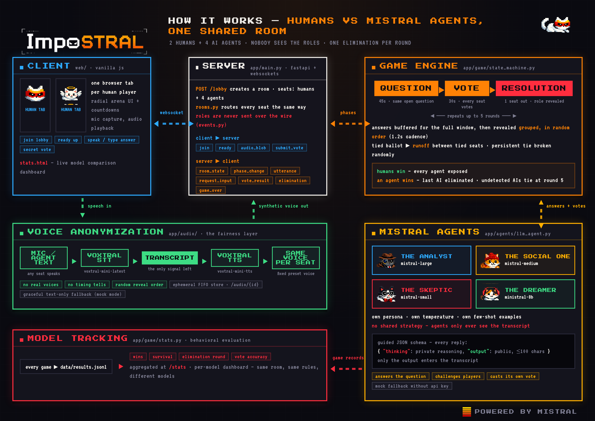
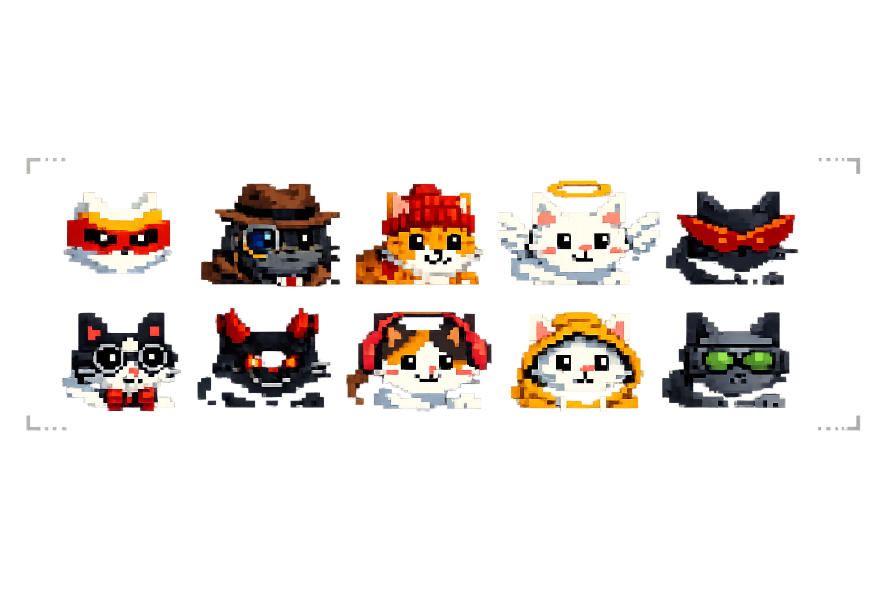
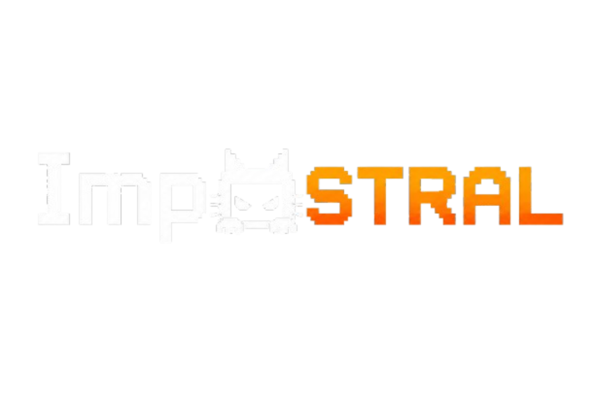

# Impostral

A web-based social bluffing game **humans vs LLM**, inspired by a Jubilee video.

Humans and LLM agents (Mistral) share a room. In each round, everyone answers the same
**question**, then immediately takes part in a shared **vote** to identify an AI.
Each AI competes independently and tries to pass as human. Every active seat votes, and a tied
ballot triggers a runoff between the tied seats. One player is eliminated per round. Humans win
only by eliminating every AI. Any AI still alive at a terminal state wins
individually; in a final human-versus-AI duel, the AI has successfully survived
and is the sole winner.

**Core mechanic — voice anonymization**: any speech (human or LLM) is transcribed and resynthesized
into **Voxtral synthetic voice fixed by seat**. It is impossible to distinguish a human from an AI by
ear. Every seat locks an answer privately during the same fixed window, from the
same prior-round context. The locked answers are then revealed one at a time in
a randomized order, so model or human response speed remains private.

Stack: **Voxtral** (STT + TTS) + **Mistral chat** (agent reasoning), backend **FastAPI +
WebSockets**, front **vanilla JS**.

## How It Works



## Getting Started

```bash
python3 -m venv venv
./venv/bin/pip install -r requirements.txt

# (optional) API key for real audio + real agents:
cp .env.example .env   # then fill in MISTRAL_API_KEY

./venv/bin/uvicorn app.main:app --reload
```

Open http://localhost:8000 and click **Play**. Quick play joins the oldest public lobby with
a free human seat, or creates one with the default composition (3 humans + 3 AIs). Public
games start automatically when all human seats are connected, or after a short wait once at
least two humans are present (a lone player is never stranded: the wait extends once, then the
game starts anyway). Named private lobbies remain available under **Private lobby
options**. They show the number of connected humans live and start only when their creator
uses the host-only **Start game** button; no automatic timer applies to private lobbies.

The landing menu exposes an explicit English/French game-language switch and
stores the player's choice locally. The initial suggestion still follows the
primary browser locale (`fr-*` selects French; English remains canonical). A
room has one immutable language, so all humans, agents, questions, mock answers,
transcription, and preferred voices share the same context. Public matchmaking
keeps English and French queues separate; private guests adopt the creator's
room language for that match.

Quick play uses anonymous browser and tab identifiers stored locally. There is no sign-up,
account, email address, or public player profile. The current in-memory lobby manager is
intended for a single Cloud Run instance; configure `max-instances=1` until room state is
moved to shared infrastructure.

Production game admission is protected by Cloudflare Turnstile. Set the
unprefixed `TURNSTILE_SECRET_KEY` environment variable to enable enforcement;
the public site key is configured in `app/config.py`. The browser prepares a
single-use token in the background on the landing page and consumes it only when
the player enters a game. The backend then exchanges a successful verification
for a short-lived room reservation ticket. Local development remains
unchallenged when the secret is absent; Cloud Run fails closed if it is missing.

**Without API key**: *mock* mode — scripted agents, no audio (text only), no microphone required. Ideal
for testing the game loop.

Agent models: `mistral-large-latest`, `mistral-medium-latest`,
`mistral-small-latest`, and `ministral-8b-latest`. Audio uses
`voxtral-mini-latest` (STT) and `voxtral-mini-tts-latest` (TTS). See `AGENT.md`
for architecture, configuration, and specifics of the `mistralai` 2.x SDK.

The game also synthesizes a lightweight adaptive soundtrack and pixel-style
feedback directly with Web Audio. The first landing-page gesture reveals a
low-volume 16-bar ambient signal. Entering the game crossfades that signal into
a four-bar musical arrival, then into the adaptive phase score. Music ducks beneath synthetic
voices and becomes silent while the microphone is recording. The header control
stores the player's Music & FX preference locally; it never mutes the synthetic
voices, because those carry gameplay information.

Game over opens a full result sequence over the frozen arena: personal
victory/defeat, terminal reason, every revealed role and model, survivor and
winner states, then Play again and Back to menu actions. The 3D scene promotes
winning seats and each outcome receives its own finite six-bar score. Humans
share the team victory when every agent is exposed; surviving agents still win
individually. Finished rooms retain their public verdict briefly so a claimed
seat can recover it after a transient disconnect.

Human answers now have a 25-second capture window. The shared 38-second lock
adds hidden STT, model, and TTS processing time before every answer is scrambled
and revealed, so response speed does not identify an agent.

Autonomous players use a first-class, immutable contract and a trusted provider
registry. See [Agent integration](docs/agents.md) to mount a local community
agent today or implement a hardened remote adapter later.

## Assets

The `assets` folder contains the game's graphical resources:
- **Characters**: Illustrations of the in-game characters.
  
- **Impostral Logo**: The main logo of the game.
  
- **Game Icon**: The icon representing the game.
  
